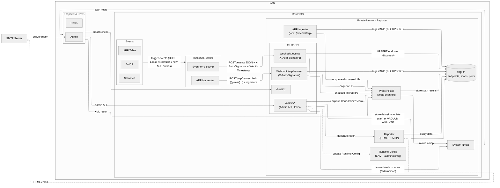
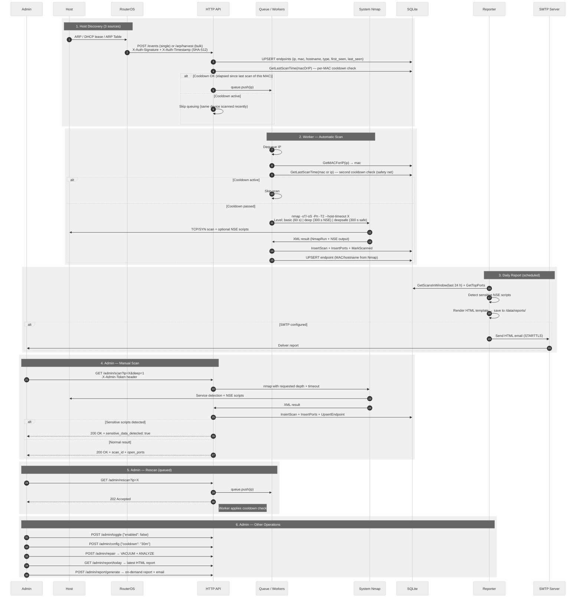

# Private Network Reporter (PNR)

A lightweight, autonomous LAN security monitoring system built with **Go**, **Nmap**, and **MikroTik RouterOS**.

PNR automatically discovers devices on a local network through three independent sources (DHCP events, Netwatch state changes, and ARP table harvesting), scans them with Nmap at configurable depth, and stores structured results in an embedded SQLite database. It generates scheduled HTML security reports with sensitive-data detection and delivers them via email — all running as a single stateless binary inside a minimal Docker container.

> **Engineering thesis project** — Maciej Matuszewski, 2025

---

## Table of Contents

- [Motivation](#motivation)
- [Key Features](#key-features)
- [Terminology](#terminology)
- [Architecture](#architecture)
- [Workflow](#workflow)
- [Discovery Architecture](#discovery-architecture)
- [Tech Stack](#tech-stack)
- [Project Structure](#project-structure)
- [Getting Started](#getting-started)
- [Configuration](#configuration)
- [API Reference](#api-reference)
- [RouterOS Integration](#routeros-integration)
- [Reports](#reports)
- [Security](#security)
- [Example Scenario](#example-scenario)
- [License](#license)

---

## Motivation

Home and small-office networks often lack visibility into what devices are connected and what services they expose. Enterprise-grade SIEM / NAC solutions are too complex and expensive for these environments. PNR was designed to fill that gap — a zero-dependency, self-contained monitoring system that plugs directly into a MikroTik router (one of the most popular SOHO platforms) and provides continuous, automated security assessment of every device on the LAN.

The project demonstrates practical application of:
- event-driven architecture with webhook-based RouterOS integration,
- concurrent scan orchestration with dual-level cooldown protection,
- cryptographic webhook authentication with replay attack prevention,
- automated HTML report generation with sensitive data detection.

---

## Key Features

- **Three independent discovery sources** — DHCP lease and Netwatch webhooks from RouterOS (`/events`), bulk ARP table push (`/arp/harvest`), and local `/proc/net/arp` monitoring (Linux container)
- **Nmap scanning pipeline** — concurrent worker pool (2–16 workers) with configurable scan levels (`basic`, `deep`, `deepsafe`; `custom` available via admin API) and dual-level per-MAC cooldown
- **Structured storage** — SQLite (WAL mode) with endpoints, scans, and port tables; full Nmap XML results stored as JSON
- **HTML security reports** — scheduled daily generation with summary/detailed modes; automatic NSE sensitive-script detection; optional SMTP email delivery
- **Admin REST API** — on-demand scans, runtime configuration, database maintenance, report generation — all rate-limited
- **Security hardened** — SHA-512 webhook signatures with timestamp validation and replay protection, admin token auth (constant-time comparison), per-operation rate limiting, TLS 1.2+ with auto-generated ECDSA certificates
- **Containerized** — single multi-stage Alpine Docker image with Nmap pre-installed; persistent `/data` volume for database, certificates, and reports

---

## Terminology

| Term | Definition |
|---|---|
| **ARP Ingester** | Module that reads the local `/proc/net/arp` table at a configurable interval (pull model, Linux only) |
| **ARP Harvester** | The `/arp/harvest` endpoint that receives batched ARP data pushed from RouterOS |
| **Endpoint** | A network device identified by its IP and/or MAC address |
| **Worker Pool** | A group of goroutines (2–16) that process the scan queue and invoke Nmap concurrently |
| **Cooldown** | Anti-flood mechanism based on **MAC address** (not IP), applied at **two levels**: before queue insertion and inside the worker. Falls back to IP when MAC is unknown |
| **Auto-scan Level** | Depth of automatic scans: `basic` (60 s), `deep` (300 s, NSE scripts), `deepsafe` (300 s, safe scripts only) |

---

## Architecture



---

## Workflow

1. **Device discovery** through three independent sources:
   - **ARP Ingester** — reads the local `/proc/net/arp` every configurable interval (Linux)
   - **Webhook `/events`** — instant notifications from RouterOS (DHCP lease, Netwatch state change)
   - **Webhook `/arp/harvest`** — periodic batch of the full ARP table from RouterOS
2. **Pre-queue cooldown check** — each source calls `GetLastScanTime(macOrIP)` (MAC preferred, IP fallback); the IP is queued only if the cooldown period has elapsed since the last scan of that **physical device** (prevents duplicate scans after DHCP renewal, dual-stack addressing, or IP aliasing).
3. **Worker pool** dequeues IPs, performs a **second per-MAC cooldown check** (safety net), then scans with Nmap at the configured `AUTO_SCAN_LEVEL` (`basic` = 60 s, `deep`/`deepsafe` = 300 s).
4. **Results** are persisted to SQLite (`scans`, `ports` tables) and the endpoint metadata is enriched with MAC/hostname from Nmap output.
5. **Daily report** is generated at the configured time, rendered from an embedded HTML template, and optionally sent via SMTP.



---

## Discovery Architecture

PNR uses **three independent discovery sources** combined with a **dual-level cooldown** mechanism:

### Sources

| Source | Model | Trigger | Scope |
|---|---|---|---|
| **ARP Ingester** | Pull (local) | Periodic read of `/proc/net/arp` | Hosts the container communicates with |
| **Webhook `/events`** | Push (instant) | DHCP lease bound, Netwatch state change | Individual host events |
| **Webhook `/arp/harvest`** | Push (batch) | Periodic full ARP table from RouterOS | Entire subnet visible to the router |

### Dual-Level Cooldown

- **Level 1 (pre-queue):** Every discovery source checks `GetLastScanTime(macOrIP)` **before** inserting into the scan queue — eliminates duplicates at the source.
- **Level 2 (worker):** Each worker re-checks cooldown **before** invoking Nmap — acts as a safety net against race conditions when multiple sources discover the same device simultaneously.

All three sources can operate concurrently and complement each other without risk of queue flooding.

---

## Tech Stack

| Layer | Technology |
|---|---|
| Language | Go 1.24 |
| Scanning | Nmap (XML output parsing) |
| Database | SQLite — WAL mode, embedded via `modernc.org/sqlite` (pure-Go driver) |
| Transport | `net/http` stdlib with TLS 1.2+ |
| Authentication | SHA-512 signatures, constant-time token comparison |
| Rate Limiting | `golang.org/x/time/rate` (token bucket, per-IP) |
| Container | Alpine Linux, multi-stage Docker build |
| Router Scripts | MikroTik RouterOS scripting language |

---

## Project Structure

```
cmd/pnr/
  main.go                # Entry point, worker pool, report scheduler, ARP ingester loop
  templates/
    report.html          # Embedded HTML report template (Go embed)

pkg/
  arp/                   # Local ARP table parser (/proc/net/arp, Linux)
  config/                # Environment-based configuration with validation
  http/                  # REST API handlers, routing, middleware
  models/                # Nmap XML data models, event/ARP entry structs
  reports/               # HTML report generator + SMTP email sender
  scanner/               # Nmap scanner interface and implementation
  security/              # SHA-512 webhook auth, admin token auth, rate limiting
  store/                 # SQLite repository — interface + implementation + schema
  tlsutil/               # Self-signed ECDSA TLS certificate generator

ROS/                     # MikroTik RouterOS scripts
  dhcp.rsc               # DHCP lease-script hook
  netwatch.rsc           # Netwatch host monitoring
  scheduler.rsc          # Scheduler for startup import + periodic ARP push
  events/
    events.rsc           # Webhook scripts (single event + batch ARP + batcher)

diagrams/                # Mermaid architecture diagrams
Dockerfile               # Multi-stage Alpine build (Go build → runtime with Nmap)
```

---

## Getting Started

### Prerequisites

- **Docker** (recommended) or **Go 1.24+** with **Nmap** installed on the host
- A MikroTik router running RouterOS 7.x *(optional — PNR can run standalone with manual API calls)*

### Docker (recommended)

```bash
docker build -t pnr .

docker run -d \
  --name pnr \
  -p 8080:8080 \
  -v pnr-data:/data \
  -e ADMIN_TOKEN="$(openssl rand -base64 32)" \
  -e EVENT_TOKEN="$(openssl rand -base64 32)" \
  -e TLS_ENABLED=true \
  pnr
```

### Build from Source

```bash
go build -o pnr ./cmd/pnr

# Nmap must be available in $PATH
ADMIN_TOKEN="your-secret-token" ./pnr
```

---

## Configuration

All settings are read from **environment variables** with sensible defaults.

| Variable | Default | Description |
|---|---|---|
| `ADMIN_TOKEN` | *(required)* | Token for admin API endpoints (min 16 chars) |
| `EVENT_TOKEN` | *(empty)* | Shared secret for RouterOS webhook SHA-512 signatures |
| `PORT` | `8080` | HTTP(S) listen port |
| `DB_PATH` | `/data/nmap.db` | SQLite database file path |
| `TZ` | `Europe/Warsaw` | Timezone for report scheduling |
| `ENABLED` | `true` | Global scan enable/disable switch |
| `MAX_WORKERS` | `2` | Concurrent Nmap scan workers (1–16) |
| `QUEUE_SIZE` | `512` | Scan queue buffer size (16–4096) |
| `COOLDOWN` | `20m` | Min interval between rescans of the same device (per-MAC) |
| **TLS** |||
| `TLS_ENABLED` | `true` | Enable HTTPS with auto-generated self-signed cert |
| `TLS_CERT_PATH` | `/data/cert.pem` | Path to TLS certificate (auto-generated if missing) |
| `TLS_KEY_PATH` | `/data/key.pem` | Path to TLS private key (auto-generated if missing) |
| **Scanning** |||
| `SCAN_MODE` | `basic` | `basic` (-sT, TCP connect) or `raw` (-sS, SYN scan, requires root) |
| `AUTO_SCAN_LEVEL` | `basic` | Worker scan depth: `basic` / `deep` / `deepsafe` |
| `HOST_PORTS` | `22,80,443,445,3389` | Default port list |
| `TIMEOUT_BASIC` | `60s` | Nmap timeout for basic scans |
| `TIMEOUT_DEEP` | `300s` | Nmap timeout for deep/deepsafe scans |
| `TIMEOUT_CUSTOM` | `300s` | Nmap timeout for custom scans (admin API) |
| `CUSTOM_SCRIPTS` | *(empty)* | NSE scripts for `custom` scan level (used by `/admin/scan`) |
| **Reports** |||
| `DAILY_REPORT_TIME` | `23:59` | Daily report generation time (HH:MM) |
| `REPORT_WINDOW` | `24h` | Time window for report data (min 1 h, max 30 d) |
| `REPORT_DETAIL` | `summary` | Report mode: `summary` or `detailed` |
| **SMTP** |||
| `SMTP_HOST` | *(empty)* | SMTP server hostname |
| `SMTP_PORT` | *(empty)* | SMTP server port |
| `SMTP_USER` | *(empty)* | SMTP username |
| `SMTP_PASS` | *(empty)* | SMTP password |
| `SMTP_FROM` | *(empty)* | Sender email address |
| `SMTP_TO` | *(empty)* | Recipient addresses (comma-separated) |
| `SMTP_STARTTLS` | `false` | Use STARTTLS for SMTP connection |
| **Rate Limiting** |||
| `RATE_LIMIT_ENABLED` | `true` | Enable rate limiting on admin endpoints |
| **Discovery** |||
| `ARP_HARVEST_ALLOW` | `true` | Allow `/arp/harvest` webhook endpoint |
| `ARP_INGESTER_ENABLED` | `false` | Enable local ARP table monitoring (Linux) |
| `ARP_INGESTER_INTERVAL` | `1m` | Interval for local ARP table parsing |

---

## API Reference

### Public Endpoints

| Method | Endpoint | Description |
|---|---|---|
| GET | `/healthz` | Health check — returns service status and configuration summary |

### Webhook Endpoints (SHA-512 signed)

| Method | Endpoint | Description |
|---|---|---|
| POST | `/events` | Single host discovery event (from RouterOS DHCP/Netwatch) |
| POST | `/arp/harvest` | Bulk ARP table import from RouterOS |

### Admin Endpoints (require `X-Admin-Token` header)

| Method | Endpoint | Description |
|---|---|---|
| GET | `/admin/health` | Authenticated health check |
| POST | `/admin/toggle` | Enable/disable scanning globally |
| GET/POST | `/admin/config` | View or update runtime configuration (cooldown, report time, workers, timeouts) |
| GET | `/admin/scan?ip=...` | Immediate on-demand Nmap scan with optional parameters (see below) |
| GET | `/admin/rescan?ip=...` | Queue IP for async scan via worker pool |
| POST | `/admin/repair` | Run SQLite VACUUM + ANALYZE |
| GET | `/admin/report/today` | Serve latest generated HTML report |
| POST | `/admin/report/generate` | Generate a new report (supports custom `from`/`to` time range) |

#### `/admin/scan` Parameters

| Parameter | Description |
|---|---|
| `ip` | Target IP address *(required)* |
| `deep` | Enable service detection + NSE scripts (`true`/`1`) |
| `deepsafe` | Enable safe NSE scripts only |
| `custom` | Use custom NSE scripts (from `scripts` param or `CUSTOM_SCRIPTS` env) |
| `mode` | `raw` (-sS, SYN) or `basic` (-sT, TCP connect) |
| `ports` | Comma-separated port list (overrides `HOST_PORTS`) |
| `timeout` | Custom scan timeout (e.g., `3m`, min 10 s, max 30 m) |
| `scripts` | NSE scripts for custom scan (e.g., `http-title,vulners`) |

#### Rate Limits

Per-IP token-bucket rate limiting protects resource-intensive operations:

| Endpoint | Limit | Reason |
|---|---|---|
| `/admin/scan` | 10 req/min | Nmap execution is CPU/network-intensive |
| `/admin/rescan` | 20 req/min | Prevents worker queue flooding |
| `/admin/repair` | 1 req/min | VACUUM locks the database briefly |
| `/admin/report/generate` | 2 req/min | Report generation involves heavy queries + render + SMTP |

Rate limiting is controlled by `RATE_LIMIT_ENABLED` and returns `429 Too Many Requests` when exceeded.

Full request/response examples are available in [`examplary-curls.txt`](examplary-curls.txt).

---

## RouterOS Integration

PNR ships with ready-to-use RouterOS scripts in the [`ROS/`](ROS/) directory.

### Event-Based Discovery (`/events`)

Each network event (DHCP lease, Netwatch state change) triggers an authenticated webhook:

```routeros
# Simplified example — full implementation in ROS/events/events.rsc
:local body ("{\"ip\":\"" . $ip . "\",\"mac\":\"" . $mac . "\",\"source\":\"routeros\"}")
:local timestamp [:tostr [:timestamp]]
:local sig [:convert ($body . $pnrSecret . $timestamp) to=hex transform=sha512]

/tool fetch mode=https url=("https://" . $pnrHost . ":" . $pnrPort . "/events") \
  http-method=post http-data=$body keep-result=no \
  http-header-field=("Content-Type:application/json,X-Auth-Signature:" . $sig . ",X-Auth-Timestamp:" . $timestamp)
```

**DHCP lease hook:**
```routeros
/ip dhcp-server set 0 lease-script=":global PnrEventIp $leaseActIP; /system script run pnr-event-on-discover"
```

### Batch ARP Harvesting (`/arp/harvest`)

The `arp-ingest-batcher` script collects the full ARP table, splits it into JSON batches (≤100 entries / ≤6 KB), and pushes them to PNR every 2 minutes via scheduler. Each batch is signed with the same SHA-512 scheme.

### Scripts Overview

| Script | Purpose |
|---|---|
| `events/events.rsc` | Installs `pnr-event-on-discover`, `send-arp-batch`, `arp-ingest-batcher` |
| `dhcp.rsc` | Configures DHCP lease-script to call `pnr-event-on-discover` |
| `netwatch.rsc` | Monitors specific hosts and sends events on state change |
| `scheduler.rsc` | Sets up startup import and periodic ARP push (every 2 min) |

### Quick Setup

```routeros
# 1. Edit pnrHost, pnrPort, pnrSecret in events.rsc
# 2. Upload and import
/import events.rsc
/import dhcp.rsc
/import scheduler.rsc
```

---

## Reports

- Generated as self-contained **HTML files** and saved to `/data/reports/`
- Scheduled daily at `DAILY_REPORT_TIME` (default: 23:59) covering the last `REPORT_WINDOW` (default: 24 h)
- **Summary mode** — host list with scan timestamps and open port counts
- **Detailed mode** — additionally includes top-N open ports statistics across all scans
- **Sensitive script detection** — automatically flags scans containing NSE scripts that reveal potentially exploitable information (e.g., `ssh-hostkey`, `ssl-cert`, `smb-os-discovery`, `ftp-anon`)
- Accessible via `GET /admin/report/today` or delivered automatically via SMTP

---

## Security

### Webhook Authentication

All webhooks from RouterOS are signed using SHA-512:

```
signature = SHA512(body + secret + timestamp)
```

Headers: `X-Auth-Signature` (hex-encoded SHA-512) + `X-Auth-Timestamp` (RouterOS timestamp format).

Protections:
- **Timestamp validation** — rejects requests older than 60 seconds or more than 30 seconds in the future
- **Replay protection** — per-source-IP tracking ensures each timestamp is strictly newer than the previous one

### Admin API

- Protected by `X-Admin-Token` header, validated with constant-time comparison
- Per-IP token-bucket rate limiting on all expensive operations

### Transport

- HTTPS enabled by default with auto-generated **ECDSA P-256** self-signed certificate
- Enforces **TLS 1.2+** with modern cipher suites (ECDHE + AES-GCM / ChaCha20-Poly1305)

### Input Validation

- IP address parsing on all scan/event endpoints
- Request body size limit (1 MB)
- Read/write/idle timeouts on the HTTP server
- Configuration bounds checking at startup (workers, queue size, cooldown, report window)

---

## Example Scenario

1. A new device connects to the network and receives a DHCP lease from the MikroTik router.
2. The router's **lease-script** fires, calling `pnr-event-on-discover` which sends `POST /events` with the device's IP and MAC, signed with `SHA512(body + secret + timestamp)`.
3. PNR **validates the signature** and timestamp, checks replay protection, and upserts the endpoint in the database.
4. PNR checks the **per-MAC cooldown** — if this physical device was scanned within the last 20 minutes, the event is acknowledged but no scan is queued.
5. Otherwise, the IP is **enqueued**. A worker picks it up, performs a second cooldown check (safety net), and launches an Nmap scan at the configured depth.
6. **Scan results** (open ports, services, versions, NSE script output) are stored in SQLite.
7. Meanwhile, the router's **ARP harvester** runs every 2 minutes, pushing the full ARP table — PNR deduplicates and queues only new or stale hosts.
8. At **23:59**, the report scheduler generates an HTML report covering the last 24 hours and sends it to the administrator via email.

---

## License

This project was developed as an engineering thesis and is available for educational and research purposes.

Author: **Maciej Matuszewski**, 2025
